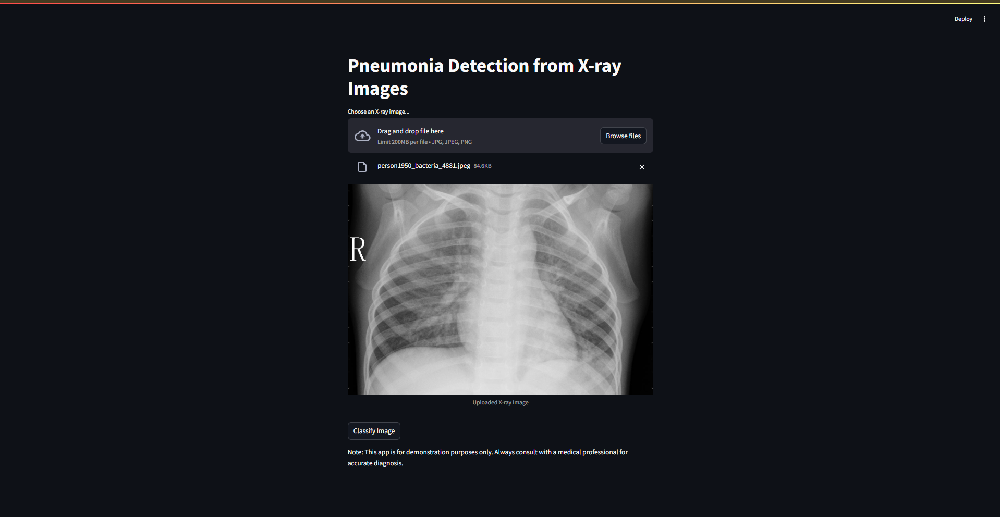
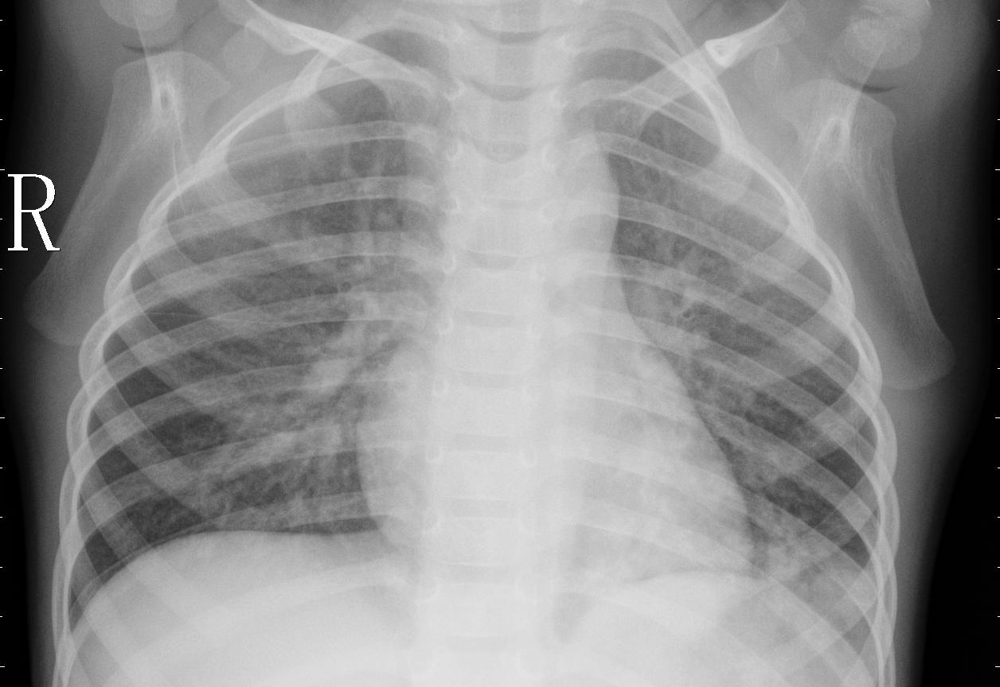

# Pneumonia Detection Using Chest X-Rays

This repository contains a web-based application for detecting pneumonia from chest X-ray images using machine learning. The application is built with Python and Streamlit, leveraging a convolutional neural network (CNN) trained on the Kaggle Chest X-ray dataset.

## Features
- Upload chest X-ray images for analysis.
- Predict whether the X-ray indicates normal lungs or pneumonia.
- Interactive web interface for seamless user experience.

## Dataset
The dataset used for training and testing is the [Chest X-Ray Images (Pneumonia)](https://www.kaggle.com/datasets/paultimothymooney/chest-xray-pneumonia) dataset from Kaggle. It consists of:
- **Train:** Images used for training the model.
- **Validation:** Images used for fine-tuning hyperparameters.
- **Test:** Images used to evaluate the final model.

The dataset is divided into two classes:
- Normal
- Pneumonia (Bacterial/Viral)

## Requirements
Ensure you have the following installed:
- Python (>= 3.8)
- pip (Python package manager)

### Python Libraries
Install the required dependencies using:
```bash
pip install -r requirements.txt
```

Here is the content of the `requirements.txt` file:
```plaintext
numpy
pandas
tensorflow
scikit-learn
streamlit
Pillow
matplotlib
```

## How to Run the Project

### 1. Clone the Repository
Clone this repository to your local machine:
```bash
git clone https://github.com/your-username/pneumonia-detection.git
cd pneumonia-detection
```

### 2. Download the Dataset
Download the dataset from [Kaggle](https://www.kaggle.com/datasets/paultimothymooney/chest-xray-pneumonia) and place it in the `data/` folder. The folder structure should look like this:
```
data/
├── train/
├── val/
└── test/
```

### 3. Train the Model
If a pre-trained model is not included, train the model by running:
```bash
python train_model.py
```
This will save the trained model as `model.h5` in the `models/` directory.

### 4. Start the Streamlit Application
Run the application using:
```bash
streamlit run app.py
```

### 5. Access the Application
Open the URL provided by Streamlit in your browser (typically `http://localhost:8501`).

## Project Structure
```plaintext
pneumonia-detection/
├── app.py               # Streamlit application
├── train_model.py       # Model training script
├── models/
│   └── model.h5         # Pre-trained model file
├── data/                # Folder for dataset
├── requirements.txt     # Python dependencies
└── README.md            # Project documentation
```

## Screenshots
### Home Page


### Upload and Predict


## Acknowledgments
- [Kaggle](https://www.kaggle.com) for providing the Chest X-ray dataset.
- TensorFlow for the deep learning framework.
- Streamlit for the web application framework.

## Contributing
Contributions are welcome! Feel free to open issues or submit pull requests for improvements or new features.

